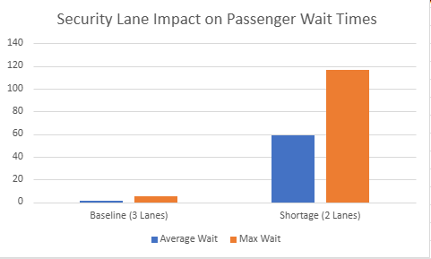

# Airport Security Queue Optimization & Bottleneck Analysis

## 📌 Project Overview
This project analyzes passenger throughput data at an airport security checkpoint to evaluate how staffing shortages affect waiting times. By comparing a standard 3-lane baseline operation against a 2-lane reduced capacity scenario, this analysis quantifies the severe operational bottlenecks caused by a single-lane closure.

## 📊 Key Insights & Metrics
A minor 1-lane reduction causes an exponential backup in the passenger queue:

| Operational Scenario | Average Wait Time | Maximum Wait Time | Performance Impact |
| :--- | :---: | :---: | :--- |
| **3 Lanes Open (Baseline)** | **1.27 minutes** | **4.82 minutes** | Smooth, stable passenger flow. |
| **2 Lanes Open (Shortage)** | **59.09 minutes** | **116.52 minutes** | **45x increase** in average wait time. |

## 📉 Data Visualization
Below is the comparison chart generated from the simulation data, illustrating the dramatic spike in both average and peak delays:

## 🛠️ Tools & Methodology
- **Data Source:** Simulated passenger arrival intervals and check-in durations.
- **Analysis Tool:** Microsoft Excel Online.
- **Functions Used:** `AVERAGE()`, `MAX()`, and conditional data normalization via `IF()`.

## 💡 Strategic Recommendations
- **Maintain Minimum Baseline:** The airport must treat 3 operational lanes as the absolute minimum requirement during standard traffic windows.
- **Predictive Staffing:** Deploy additional personnel dynamically based on peak flight departure windows to prevent the queue from cascading into a 2-hour delay, mitigating the risk of missed flights.
